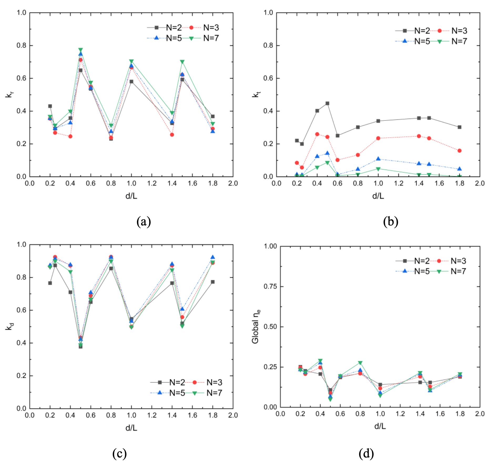

# Elastic-wave-energy-converter-FWEC-

Array analysis of flexible wave energy converter


Paper can be found 
```
@article{wei2024array,
  title={Array analysis on a seawall type of deformable wave energy converters},
  author={Wei, Yujia and Wang, Chao and Chen, Wenchuang and Huang, Luofeng},
  journal={Renewable Energy},
  volume={225},
  pages={120344},
  year={2024},
  publisher={Elsevier}
}
@article{wang2024hydroelastic,
  title={Hydroelastic modelling of a deformable wave energy converter including power take-off},
  author={Wang, Chao and Wei, Yujia and Chen, Wenchuang and Huang, Luofeng},
  journal={Marine Structures},
  volume={98},
  pages={103678},
  year={2024},
  publisher={Elsevier}
}
@article{wang2024interactive,
  title={Interactive effects of deformable wave energy converters operating in close proximity},
  author={Wang, Chao and Wei, Yujia and Chen, Wenchuang and Huang, Luofeng},
  journal={Energy},
  volume={308},
  pages={132905},
  year={2024},
  publisher={Elsevier}
}
```

<table>
  <tr>
    <th>Flexible wave energy converter array</th>
    <th>Energy outputs</th>
  </tr>
  <tr>
    <td></td>
    <td></td>
  </tr>
</table>
